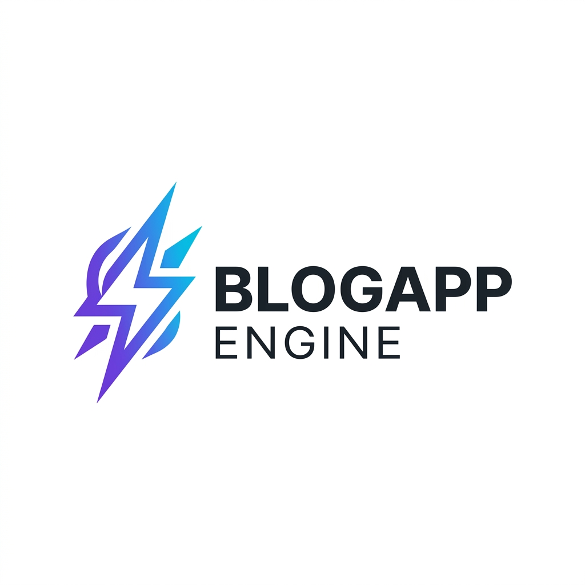

<div align="center">
  
  
  # 🚀 BlogApp Engine
  
  **Next-Generation Content Engine with RESTful API Integration**
  
  [](https://opensource.org/licenses/MIT)
  [](https://nodejs.org/)
  [](#security-first)
  [](#design-aesthetics)

  [Tentang Proyek](#about) • [Fitur Utama](#features) • [Instalasi](#quick-start) • [Dokumentasi API](#api-reference)
</div>

---

## 📖 Tentang Proyek <a name="about"></a>

**BlogApp Engine** adalah platform publikasi konten digital yang dirancang untuk kecepatan, keamanan, dan fleksibilitas. Dengan pendekatan *API-first*, engine ini memungkinkan Anda untuk mengelola konten melalui backend Node.js yang ringan dan menyajikannya ke berbagai platform frontend dengan integrasi RESTful API yang mulus.

Dibangun dengan fokus pada **estetika premium** dan **keamanan tingkat tinggi**, BlogApp Engine bukan sekadar blog biasa—ini adalah solusi infrastruktur konten modern.

## ✨ Fitur Utama <a name="features"></a>

- **🛡️ Defense-in-Depth Security**: Proteksi otomatis terhadap serangan XSS (Cross-Site Scripting) di seluruh input data.
- **🚀 High-Performance API**: Endpoint publik yang dioptimalkan dengan caching-ready arsitektur dan CORS support.
- **📊 Real-time Analytics**: Pelacakan otomatis untuk jumlah tayangan (views), suka (likes), dan statistik konten global.
- **🎨 Premium UI/UX**: Frontend modern berbasis TailwindCSS dengan animasi *glassmorphism* dan interaksi yang responsif.
- **🔐 Hardened Headers**: Menggunakan `Helmet.js` dengan konfigurasi Content Security Policy (CSP) yang ketat.
- **⚡ Rate Limiting**: Proteksi bawaan terhadap serangan brute-force dan penyalahgunaan API.

## 🛠️ Stack Teknologi <a name="tech-stack"></a>

- **Backend**: Node.js, Express.js (v5+)
- **Security**: Helmet.js, XSS, Express Rate Limit
- **Storage**: JSON-based flat file (No database configuration required!)
- **Frontend**: TailwindCSS, Vanilla JavaScript, FontAwesome 6

## 🚀 Instalasi Cepat <a name="quick-start"></a>

### Prasyarat
- Node.js v18 atau lebih tinggi
- NPM atau Yarn

### Langkah-langkah
1. **Clone repositori**
   ```bash
   git clone https://github.com/saipul12c/blog.git
   cd blog-app-engine
   ```

2. **Instal dependensi**
   ```bash
   npm install
   ```

3. **Jalankan aplikasi**
   ```bash
   npm start
   ```
   Aplikasi akan berjalan di `http://localhost:3000`.

## 📄 Dokumentasi API <a name="api-reference"></a>

BlogApp Engine dilengkapi dengan dokumentasi interaktif bawaan yang dapat diakses di `/docs`.

| Endpoint | Method | Deskripsi |
| :--- | :--- | :--- |
| `/api/public/posts` | `GET` | Daftar artikel (Filter by category, tag, search) |
| `/api/public/posts/:slug` | `GET` | Detail lengkap artikel berdasarkan slug |
| `/api/public/categories` | `GET` | Daftar semua kategori aktif |
| `/api/posts` | `POST` | Membuat konten baru (Hardened against XSS) |

---

## 🔒 Security First <a name="security-first"></a>

Keamanan adalah prioritas utama kami. Setiap data yang masuk melalui API disanitasi menggunakan algoritma khusus untuk mencegah injeksi script. Kami juga menerapkan kebijakan **CSP (Content Security Policy)** yang hanya mengizinkan sumber daya terpercaya untuk dimuat, meminimalisir risiko serangan *supply chain* atau *malicious scripts*.

## 📄 Lisensi

Proyek ini dilisensikan di bawah **MIT License**. Silakan gunakan, modifikasi, dan distribusikan sesuai kebutuhan Anda.

---

<div align="center">
  Dibuat dengan ❤️ oleh <a href="https://github.com/antigravity">Antigravity</a>
</div>